<!--
  ─────────────────────────────────────────────────────────────
  SETUP: this file lives in the repo  USERNAME/USERNAME  (same name as your account).
  Find-and-replace  USERNAME  with your real GitHub handle (it appears ~15x).
  header.svg goes in the repo root. snake.yml goes in .github/workflows/.
  ─────────────────────────────────────────────────────────────
-->

<div align="center">



[](https://git.io/typing-svg)

[](https://your-portfolio.vercel.app)
[](https://linkedin.com/in/USERNAME)
[](https://tryhackme.com/p/USERNAME)
[](https://app.hackthebox.com/profile)
[](mailto:you@example.com)

</div>

---

### `> cat ./whoami.txt`

```bash
Cybersecurity M.S. — focused on offensive security, SOC operations, and cloud.
CEH certified  ·  OSCP in progress.
I break web applications, hunt threats in SIEM, respond to incidents,
and automate the parts that shouldn't be done by hand.

Currently: shipping AD lab projects, building security tooling, hunting roles.
```

### `> ps aux | grep current_ops`

- 🔭 &nbsp;Building a laddered Active Directory attack/defense lab portfolio
- 🛠️ &nbsp;Writing recon + job-discovery automation (Python · Playwright · MCP)
- 📚 &nbsp;Grinding **OSCP** — exploit dev, privesc, pivoting
- 🤝 &nbsp;Open to **SOC Analyst** & **Cloud Security** roles

---

<div align="center">

### `> ./load_arsenal.sh`

**OFFENSIVE**
&nbsp;


**BLUE TEAM / SIEM**
&nbsp;


**CLOUD / INFRA**
&nbsp;


**LANGUAGES / OS**
&nbsp;


</div>

---

<div align="center">

### `> systemctl status github`


</div>

---

<div align="center">

### `> ./snake --eat-contributions`

<picture>
  <source media="(prefers-color-scheme: dark)" srcset="https://raw.githubusercontent.com/USERNAME/USERNAME/output/snake-dark.svg" />
  
</picture>

<br/><br/>


<sub><code>// access logged · session terminated · stay curious</code></sub>

</div>
